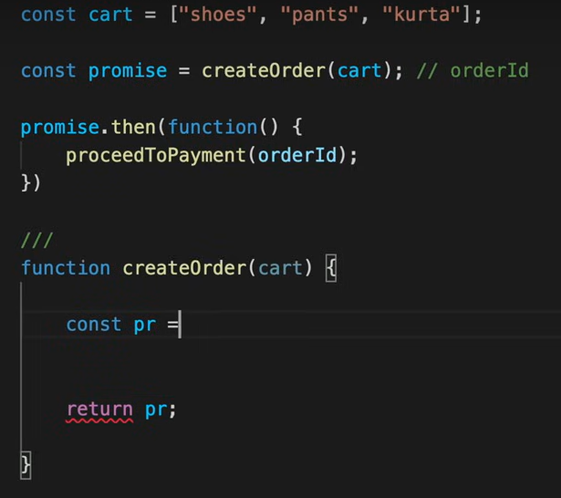
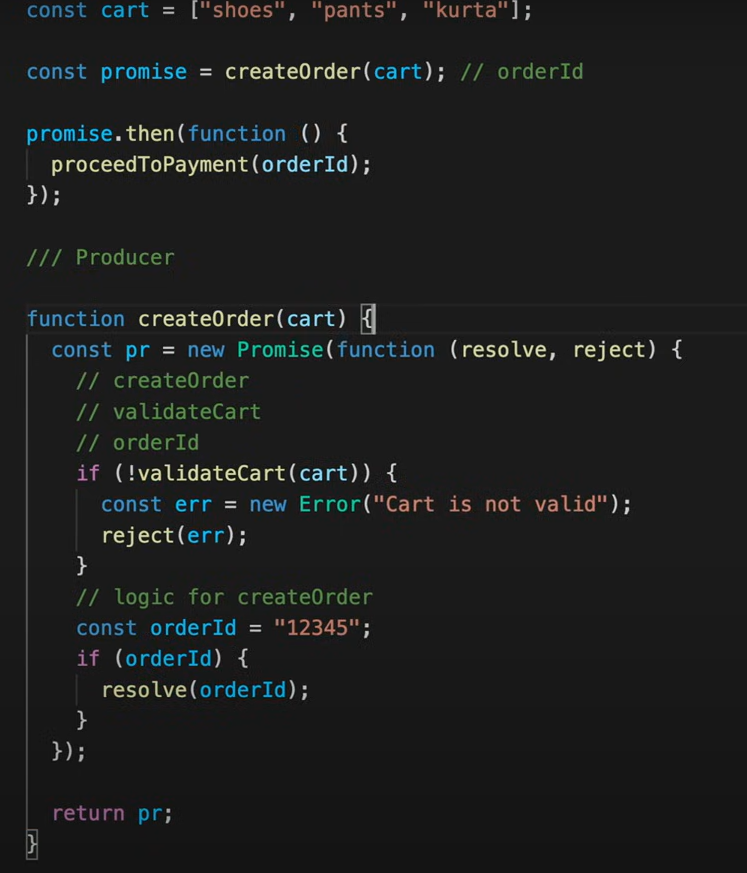
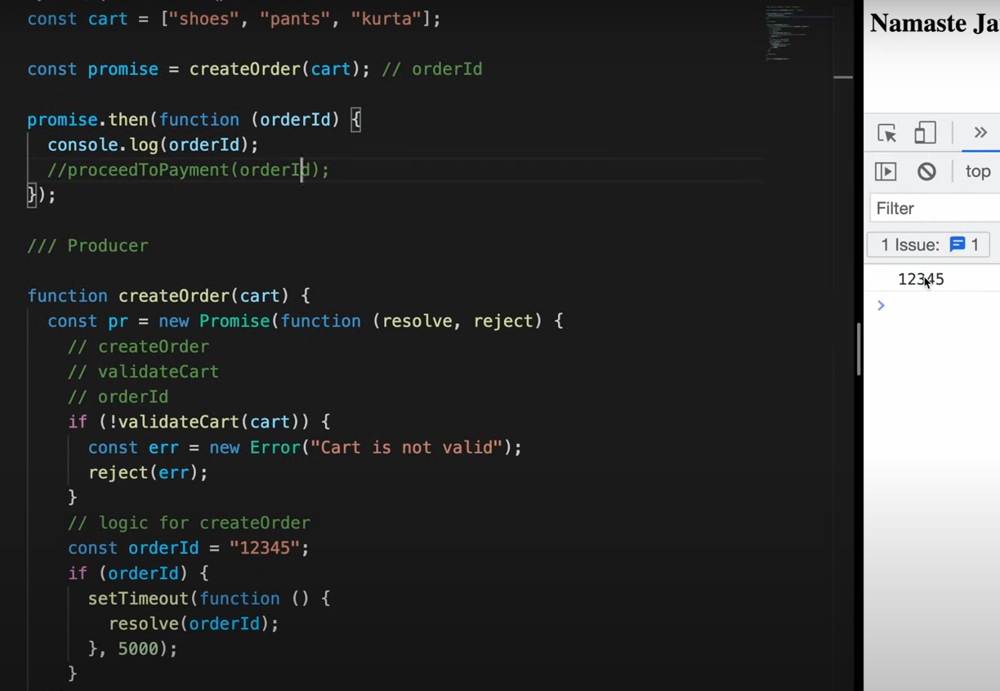
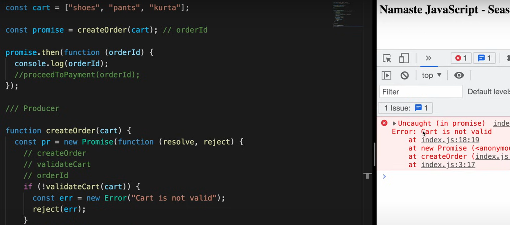
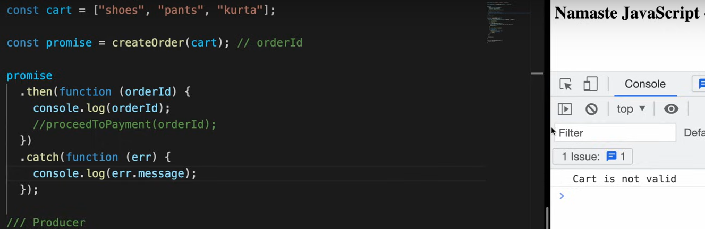
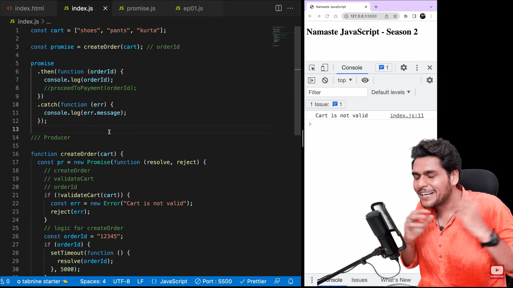
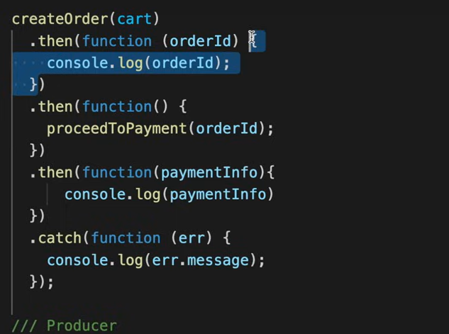
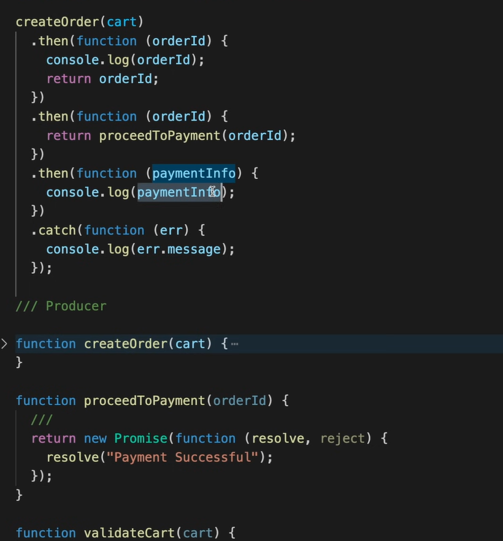
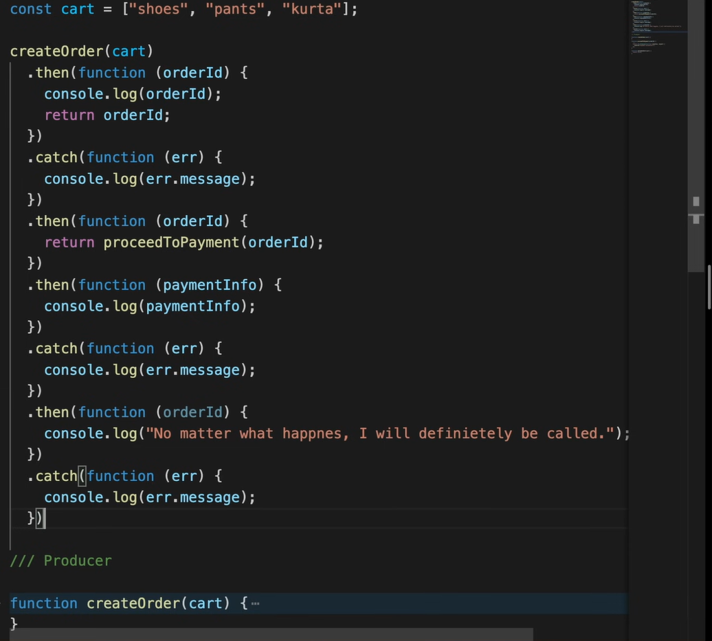

# JS_Namst

# part 3
.....

......

........

## take 5 sec to resolve (no error)

......
## give error in red color ❌❌❌

.....
## use catch for not resolve 

......

## Error in chaining   .... use return

## wothout error

## use multiple catch and all case each function is called 

